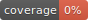

Dart Utils
==========

A library for Dart developers.

Created from templates made available by Stagehand under a BSD-style
[license](https://github.com/dart-lang/stagehand/blob/master/LICENSE).



## Usage

A simple usage example:

```dart
import 'package:dart_util/dart_util.dart';

main() {
}
```

## Features

* A number of pre-defined regular expressions for ease of reuse and correctness.